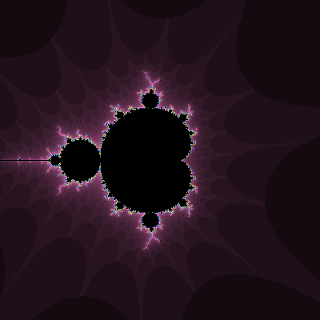
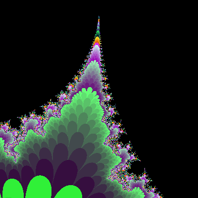

# mandelbrot
A try to implement a mandelbrot set visualization in C++, using SDL.

# Demo
 

# How to Compile
## Pre-requisites:
* Any C++ compiler. g++ is recommended.
* Make (if you are on linux to automate compile and run)
* SDL2.0 Development Libraries
* A brain

## Getting SDL
### On Windows (for MinGW):
1. Go to libSDL2.0 download page: [here](http://libsdl.org/download-2.0.php "libSDL2.0 Download Page")
2. Under Development Libraries -> Windows, download the tar archive for MinGW.
3. Now, copy and paste the **appropriate** files from the archive in your MinGW directory (usually C:\\MinGW\\).

   For **32-bit** installation of MinGW, copy the contents of *"i686-w64-mingw32"* folder in archive and paste in C:\\MinGW\\.  
   For **64-bit** installation of MinGW, copy the contents of *"x86_64-w64-mingw32"* folder in archive and paste in C:\\MinGW\\.  

4. You are done with installation of necessary SDL files to compile the program.

### On Arch:
Run this command in terminal:
```terminal
sudo pacman -S sdl2
```
**OR** use your favorite package manager if you are not a fan of pacman.

### On Ubuntu/Debian based OS:
Install the libsdl2-2.0 and libsdl2-dev using your favorite package manager.
An example command using apt would look like this: 
```terminal
sudo apt install libsdl2-2.0 libsdl2-dev
```

## Compiling
### On Linux (using make):
Navigate to src directory in terminal and type the following command:
```terminal
make all
```

This will compile and run the program.

### On Linux (without make):
Navigate to src directory in terminal and type the following command to compile the program.cpp file:
```terminal
g++ main.cpp -Ofast -lSDL2 -o program.out 
```

-Ofast flag tells the compiler to optimize the program for best performance. You can modify this flag to your liking.

To run the program, type the following command while in the same directory:
```terminal
./program.out
```

### On Windows (using MinGW and g++)
Navigate to the src directory in command prompt and type in the following command:
```terminal
g++ main.cpp -Ofast -lmingw32 -lSDL2main -lSDL2 -o program.exe
```
To run the program, type the following command while command prompt is in the same directory:
```terminal
program
```

# User Guide
Run the program and you will be shown a mandelbrot visualization.

Use the following keys to navigate the space:

| Key        | Effect                |
|:----------:|:---------------------:|
| Arrow Keys | Move in space         |
| J          | Zoom in on fractal    |
| K          | Zoom out from fractal |

# Final Words
This was my first attempt at making a fractal visualization software. This software is not meant to be fast, accurate or even beautiful. It was something that I did for fun and I learned a lot in the process.

The algorithm is known as "Escape Time Algorithm". A lot of information was taken from Mandelbrot's page on wikipedia, fractal forum and from [this](https://www.youtube.com/watch?v=6z7GQewK-Ks) youtube video.

The program outputs the milliseconds it took to generate the fractal in the console, so keep an eye on it. Maybe use it for benchmarking different machines.
